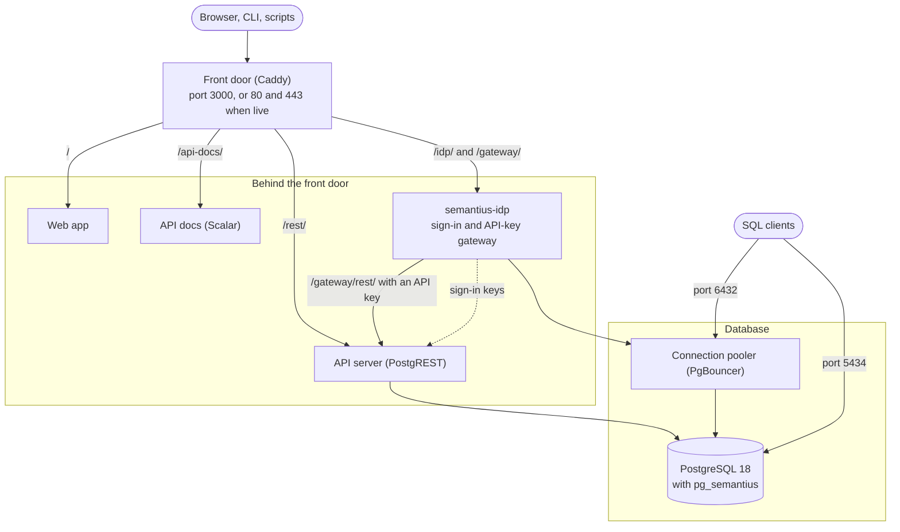

import RepoCard from '~/components/common/RepoCard.astro';

**Semantius Open Source** is the free, MIT-licensed, self-hosted edition of Semantius. It runs on hardware you control, as one Docker Compose setup that starts the whole platform in a single command: the database, the HTTP API, the browsable API docs, the web app, and sign-in.

The same platform also runs as a managed service at [app.semantius.com](https://app.semantius.com).

<RepoCard repo="semantius/semantius-self-hosted" license="MIT" description="The whole Semantius platform in one Docker Compose setup: database, API, web app and sign-in." />

## Which Setup Do You Need?

There are three ways to get Semantius, and only one of them is this section:

| You want | Use |
| --- | --- |
| The whole platform (app, API, sign-in, database) on your machine or server | **Self-Hosting**, this section. Start with the [Quick Start](/docs/self-hosted/quick-start). |
| Only the database engine, in a PostgreSQL you already run | [pg_semantius: Install](/docs/pg-semantius/install) or [pg_semantius: Docker Image](/docs/pg-semantius/docker) |
| Nothing to install or run at all | The managed service at [app.semantius.com](https://app.semantius.com) |

## Why Self-Host

- **Your data stays with you.** The database runs on your machine or your server, and nothing has to leave it.
- **It runs air-gapped.** Once the images are on the machine, nothing connects to Semantius or the internet: no telemetry and no license check. People reach it over your own network. Only installing and updating download images, and automatic HTTPS for a public domain needs to reach Let's Encrypt.
- **It is the full open-source platform.** The same semantic model, API, web app and permissions the managed service runs. This is not a trimmed-down demo edition.
- **It is easy to throw away.** One command creates it, one command removes it, so it is a safe place to experiment.

## Is Self-Hosting Right for You?

Self-hosting suits you if you want your data on infrastructure you control, have compliance requirements that rule out a managed service, or want to try Semantius locally without an account.

The Quick Start needs nothing beyond running a few commands. **Running it for other people** assumes you are comfortable with Docker and Docker Compose, basic Linux server administration, and DNS, HTTPS and firewalls. **You are responsible for** the server, security updates, backups and restores, upgrades, and uptime.

If you would rather not run it yourself, [app.semantius.com](https://app.semantius.com) runs the platform for you.

**Found a security issue?** Report it privately through the **Security** tab of the [semantius-self-hosted repository](https://github.com/semantius/semantius-self-hosted/security), using **Report a vulnerability**, rather than in a public issue.

## Self-Hosted and Managed Compared

| | Self-hosted | Managed at app.semantius.com |
| --- | --- | --- |
| Semantic model, API, web app, permissions | Included | Included |
| Sign-in | semantius-idp, or your own identity provider | Managed for you |
| Operations, monitoring and updates | You | Semantius |
| Backups and restores | You | Semantius |
| Analytics (Cube) | Not included | Included |
| Remote MCP servers for agents | Not included | Included |
| Webhooks | Not included | Included |
| Send email action | Not included | Included |
| Cost | Your own server | A plan |
| License | MIT | Service |

## What Actually Starts

You run one command and get a small set of programs running side by side in Docker. You only ever open **one address** in a browser, and everything is reachable behind it:

| Address | What it is |
| --- | --- |
| `http://localhost:3000/` | The Semantius web app. This is where you sign in and work. |
| `http://localhost:3000/api-docs/` | Browsable API documentation, with a button to try any call live. |
| `http://localhost:3000/rest/` | The HTTP API itself, generated from your model. |
| `http://localhost:3000/gateway/rest/` | The same API for scripts, which accepts an API key instead of a sign-in. |
| `http://localhost:3000/idp/` | The bundled sign-in service: accounts, users, and API keys. |

Behind that one address, a front door passes each request to the program that handles it:

You do not have to install or configure any of these individually. They are described once in a Docker Compose file and started together.

The diagram shows the default variant, where semantius-idp handles both sign-in and personal API keys. With an identity provider you already run, such as [Microsoft Entra ID](/docs/self-hosted/entra-id), that provider signs people in instead. Scripts then use tokens from your provider, or an API gateway of your choice, such as Kong, Tyk or AWS API Gateway, placed in front of `/rest/` if you want personal API keys.

## Building Blocks

The platform is assembled from separate open-source projects, each with its own repository and image. Three are Semantius projects; the others are well-known upstream projects, used unmodified.

| Building block | Role | Source | Image | Version setting |
| --- | --- | --- | --- | --- |
| PostgreSQL 18 with [pg_semantius](/docs/pg-semantius) | The database and the semantic model | [semantius/semantius](https://github.com/semantius/semantius) (MIT) | `ghcr.io/semantius/postgres` | `SEMANTIUS_DB_VERSION` |
| Semantius web app | The app people work in | [semantius/semantius-app](https://github.com/semantius/semantius-app) (MIT) | `ghcr.io/semantius/semantius-app` | `SEMANTIUS_APP_VERSION` |
| semantius-idp | Sign-in and accounts, plus a built-in API gateway for personal API keys. Used when you do not bring your own identity provider | [semantius/semantius-idp](https://github.com/semantius/semantius-idp) (MIT) | `ghcr.io/semantius/semantius-idp` | `SEMANTIUS_IDP_VERSION` |
| PostgREST | The API server, generated from the database | [PostgREST/postgrest](https://github.com/PostgREST/postgrest) (MIT) | `postgrest/postgrest` | Not yet |
| PgBouncer | The connection pooler | [pgbouncer/pgbouncer](https://github.com/pgbouncer/pgbouncer) (ISC) | `edoburu/pgbouncer` | Not yet |
| Scalar | The API docs viewer | [scalar/scalar](https://github.com/scalar/scalar) (MIT) | `scalarapi/api-reference` | Not yet |
| Caddy | The front door, and automatic HTTPS | [caddyserver/caddy](https://github.com/caddyserver/caddy) (Apache 2.0) | `caddy:2-alpine` | Not yet |
| The stack itself | The templates, the generator and the ready-made variants | [semantius/semantius-self-hosted](https://github.com/semantius/semantius-self-hosted) (MIT) | None | None |

The [`semantius` CLI](/docs/cli), which coding agents use, runs on your own machine rather than in the stack. Its source is [semantius/semantius-cli](https://github.com/semantius/semantius-cli) (MIT).

## Sign-In: Standard OpenID Connect

Semantius has no login system of its own. The API and the database accept standard OpenID Connect access tokens, which are signed JWTs (JSON Web Tokens), and check each one against your identity provider's published signing keys. Your identity provider decides **who may sign in**. Semantius's roles and permissions, enforced inside PostgreSQL, decide **what they can see**.

That split is what IT teams usually ask for. Single sign-on, multi-factor authentication and offboarding stay in the identity provider your organization already runs, rather than in a second user list.

- **Use the provider you already run.** Microsoft Entra ID has a ready-made variant, with a script that registers the web app, the API and the `semantius` CLI for you ([Microsoft Entra ID](/docs/self-hosted/entra-id)). Other OpenID Connect providers that issue JWT access tokens, such as Okta, Keycloak and Auth0, work the same way, through settings or a variant of their own ([Variants](/docs/self-hosted/variants#pointing-a-variant-at-another-provider)).
- **No provider, or no time to set one up?** The default setup bundles [semantius-idp](/docs/self-hosted/semantius-idp), an MIT-licensed OAuth 2.1 and OpenID Connect provider with a built-in API gateway for personal API keys. So you need neither a separate identity provider nor a separate gateway. It comes already configured for the Semantius web app and the `semantius` CLI, so nothing needs registering anywhere.

With the bundled provider, the user list is empty on first run, so the sign-in page doubles as the setup page: the first person to complete it becomes the administrator. There is no default password to look up and no account to register anywhere.

## Choose Your Variant

The stack is defined once and generated into ready-made **variants**, one per combination of platform and sign-in provider. Each variant folder is complete and self-contained, so you pick one and ignore the rest.

| Variant | Best for | Sign-in handled by | Guide |
| --- | --- | --- | --- |
| `variants/local-semantius-idp/` | Your laptop, a test box, or a plain server. **Start here.** | The bundled semantius-idp | [Quick Start](/docs/self-hosted/quick-start), then [Going Live](/docs/self-hosted/deploy) |
| `variants/local-entra-idp/` | Organizations that already sign in with Microsoft | Microsoft Entra ID | [Microsoft Entra ID](/docs/self-hosted/entra-id) |
| `variants/dokploy-semantius-idp/` | One-click deployment on a Dokploy server | The bundled semantius-idp | [Dokploy](/docs/self-hosted/dokploy) |

Unless you have a reason to do otherwise, use the first one. It needs no accounts, no registrations, and no configuration to start.

None of them an exact fit? Most differences are a setting in `.env`. A new combination, such as Dokploy with Entra ID or Docker Compose with Okta, is a short definition file and one build command. [Choose or Build Your Variant](/docs/self-hosted/variants) explains both, and which of the following pages apply to each variant.

## What You Need

- **Docker with Compose v2.** Docker Desktop on Windows or macOS includes both. On Linux, install Docker Engine with the Compose plugin. Check with `docker compose version`.
- **Git**, to download the files. If you do not have it, download the repository as a ZIP from its GitHub page instead.
- **About 5 GB of free disk space** for the downloaded images and the database.

That is all. Every piece is downloaded as a prebuilt image. There is no compiler to install, no Node.js, no separate PostgreSQL, and nothing gets built from source on your machine. Node.js only comes in if you generate a variant of your own.

## Next Steps

- **[Quick Start](/docs/self-hosted/quick-start)**: get it running and sign in for the first time.
- **[Running Your Stack](/docs/self-hosted/running-your-stack)**: the everyday commands, API keys, backups, and how to update.
- **[Going Live](/docs/self-hosted/deploy)**: move it to a real server with your own domain and HTTPS.
- **[Dokploy](/docs/self-hosted/dokploy)**: deploy it through Dokploy without editing config files.
- **[Microsoft Entra ID](/docs/self-hosted/entra-id)**: sign people in with their Microsoft work accounts.
- **[semantius-idp](/docs/self-hosted/semantius-idp)**: the bundled sign-in service and API gateway.
- **[Variants](/docs/self-hosted/variants)**: adjust a variant, or generate one for another platform or provider.
- **[Settings Reference](/docs/self-hosted/settings)**: every value in the settings file, grouped by what it does.
